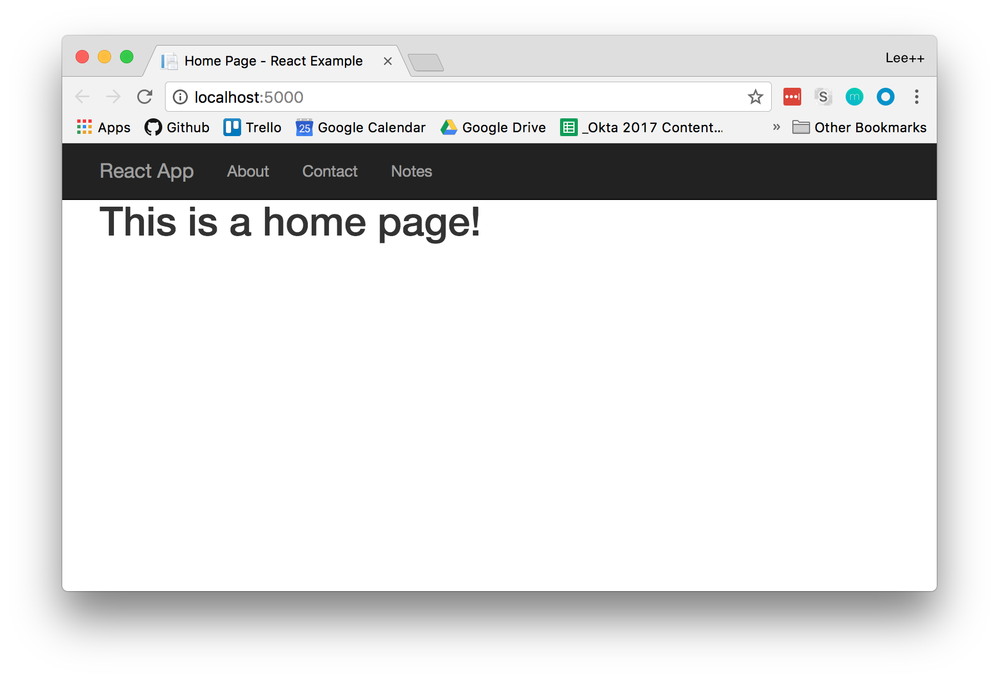

# Build a .NET Core App with React and Authentication

This example is the starting point for th post: [Build A Secure CRUD App with ASP.NET Core and React](https://developer.okta.com/blog/2018/07/02/build-a-secure-crud-app-with-aspnetcore-and-react).

**Prerequisites**:
Make sure you have the .NET Framework 2.0, Node 8 or better, and NPM installed.

## Getting Started

You can start with a basic application that has .NET serving up a React app, and the API for that React app by cloning the following repository:

```bash
git clone https://github.com/oktadeveloper/okta-dotnetcore-react-example.git 
cd okta-dotnetcore-react-example
npm install
dotnet build
dotnet run
```

You should see something similar to this:



## Help

Please post any questions as comments on the repo's [blog post](https://developer.okta.com/blog/2018/07/02/build-a-secure-crud-app-with-aspnetcore-and-react), or visit our [Okta Developer Forums](https://devforum.okta.com).

## LICENSE

Apache 2.0, see [LICENSE](LICENSE)